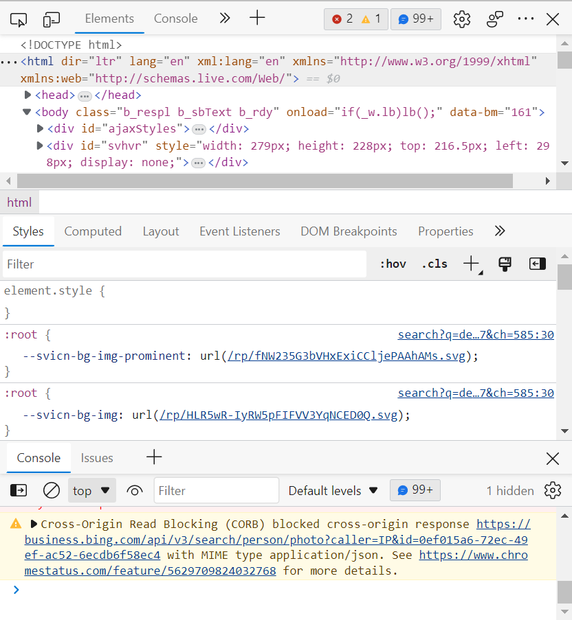
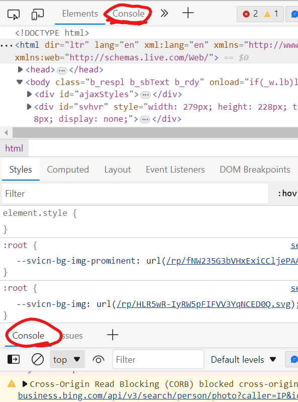

# Homemade
Some hacks for little offline games that I made.

## Games
- Boxel Rebound 🎲

## Insert code
1. Open Devtools
Shortcuts: CTRL + SHIFT + i (Windows) 🪟 \
           COMMAND + SHIFT + i (Mac) 🍎
2. Open the console
Now it should look like this:

Now for the console you can choose one of these:

Then paste the code at the arrow.
